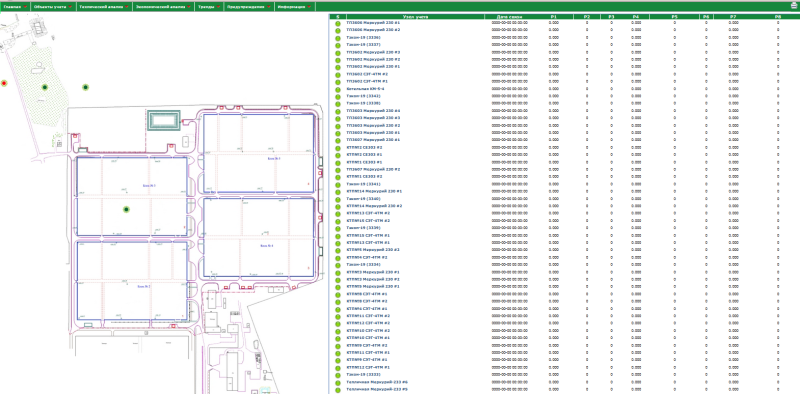

Система учета энергоресурсов.
В данном репозитории находится код сервера визуализации на чистом PHP (никаких фреймворков, давно это было).
Реализован сервер сбора, обработки и визуализации информации о потреблении энергоресурсов (электроэнергия, вода, тепло, газ). 
Сбор осуществляется с помощью контроллера escada/dk (C/C++/Linux/MySQL). 
Приборы учета: Тэкон-19, Меркурий 230/233, СЭТ-4ТМ, Энергомера СЕ303, PLC-модемы, теплосчетчики КМ-5, Тэкон-19, Взлет-ТСРВ. 
Отчеты, аналитика, графики и прочее прилагаются.

